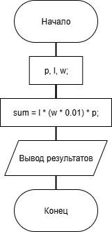

# Домашнее задание к работе 2

### Условие:
В магазине продаётся костюмная ткань. Её цена B рублей за кв. метр. Напишите программу, которая подсчитает и выведет на экран стоимость куска этой ткани длиной X м и шириной 80 см.

### Алгоритм:
1. Начало
2. Объявить и инициализировать переменные;  
	`float price = 480, length = 3, width = 80, sum;` 
3. Вычислить сумму;    
	`sum = length * (width * 0.01) * price;`    
4. Оформить вывод результатов (условие/дано/ответ). 
5. Конец

### Блок-схема:

## 2. Реализация программы 

#include <locale.h>
#include <stdio.h>

int main()
{
	setlocale(LC_CTYPE, "RUS");

	// Инициализация переменных (длину lenght приудмал сам, в в условии - X)
	float price = 480, length = 3, width = 80, sum;

	//вычисляем сумму
	sum = length * (width * 0.01) * price;

	//вывод условия/решения/ответа
	printf("В магазине продаётся костюмная ткань. Её цена B рублей за кв. метр.\n");
	printf("Напишите программу, которая подсчитает и выведет на экран стоимость\n");
	printf("куска этой ткани длиной X м и шириной 80 см.\n\n");
	printf("Дано:\nЦена ткани - 480 руб/кв.м.\nДлина тк. - 3 м\nЩирина тк. - 80 см (0.8 м)\n- - - - -\n");
	printf("Решение:\nСтоимость = (%1.0f * %2.1f) * %2.0f = %2.0f (руб.)\n", length * 1., width * 0.01, price * 1., sum);
	printf("- - - - -\nОтвет: %2.0f рублей.\n\n\n", sum);

}

## 3. Результаты работы программы

В магазине продаётся костюмная ткань. Её цена B рублей за кв. метр.
Напишите программу, которая подсчитает и выведет на экран стоимость
куска этой ткани длиной X м и шириной 80 см.

Дано:
Цена ткани - 480 руб/кв.м.
Длина тк. - 3 м
Щирина тк. - 80 см (0.8 м)
- - - - -
Решение:
Стоимость = (3 * 0.8) * 480 = 1152 (руб.)
- - - - -
Ответ: 1152 рублей.